  <!-- HEADER -->
  

  <!-- ANIMASI TEKS -->
   

  <!-- DIVIDER -->
  

    

  
  
  

---

### About Me

Halo. Perkenalkan nama saya **Nanda Alrezel Rifanie**, seorang Web Developer dan UI/UX Designer pemula. Prinsip kerja saya cukup sederhana, kalau lagi ada niat dan inspirasi datang, saya bisa berjam-jam fokus ngoding atau merapikan desain sampai detail terkecil. Tapi kalau niatnya lagi hilang entah ke mana, ya paling PC nyala sementara yang dibuka bukannya VS Code malah Facebook atau gak lanjut baca novel di HP.

Saat ini saya sedang fokus mengerjakan dan mengembangkan project web **HS15**, mulai dari struktur sampai tampilan antarmukanya. Di samping itu, saya juga meluangkan waktu untuk belajar **Flutter & Dart**, berhubung ada rasa penasaran dan ketertarikan untuk coba-coba memperluas wawasan ke dunia pengembangan aplikasi mobile.

| | |
|---|---|
| **Skill** | Web Developer · UI/UX Designer |
| **Sedang Mengerjakan** | Project Web HS15 |
| **Sedang Mempelajari** | Flutter & Dart |
| **Fun Fact** | PC nyala, tapi orangnya entah kemana |

---

### Tech Stack

  

---

### GitHub Statistics

  

---

### Contributions

  <picture>
    <source media="(prefers-color-scheme: dark)" srcset="https://raw.githubusercontent.com/zerabyte88/zerabyte88/output/galaga-contribution-graph-dark.svg">
    <source media="(prefers-color-scheme: light)" srcset="https://raw.githubusercontent.com/zerabyte88/zerabyte88/output/galaga-contribution-graph.svg">
    
  </picture>

---

  

